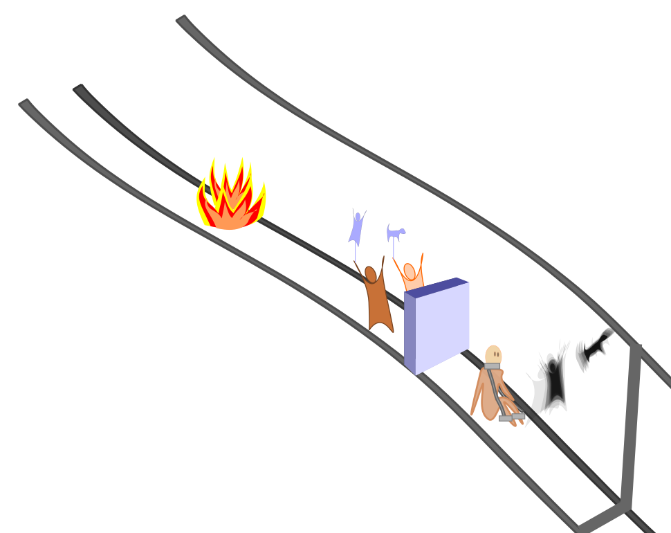
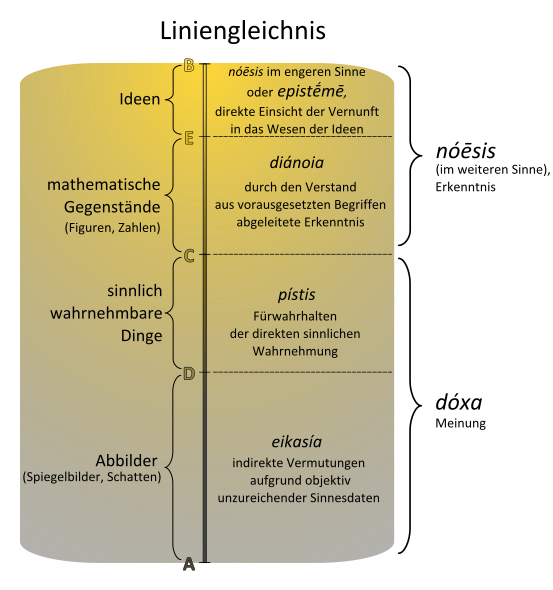

# Werte und Normen - Abitur
## Lebensentwuerfe
### Identitaet im beschleunigten Zeitalter
#### Hartmut Rosa - Muße braucht Zeit

Gründe für den Zeitmangel:
- Technische Beschleunigung -> Fortschritte in der technischen Entwicklung führen zu schnelleren Kommunikationswegen,
  welche zu einer erhöhten Reaktionsfrequenz führen
- Sozialer Wandel -> Arbeitsstellen, Wohnorte, Lebenspartner usw. werden schneller gewechselt,
  daraus folgt eine geringere Stabilität des sozialen Konstrukts um einen herum.
- Allgemeine Beschleunigung des Lebenstempos -> Wir versuchen mehr Dinge in weniger Zeit zu erledigen,
  da wir glauben so mehr Zeit für Anderes zu haben.

Gründe dafür, dass individuelle Entschleunigungsstrategien nicht funktionieren:
Da die Gesellschaft dieses Maß an Geschwindigkeit von uns erwartet, verlieren Entschleunigte den Anschluss.
Sie werden abgehängt von denjenigen, die nicht entschleunigen und fallen in ihrem sozialen Umfeld zurück.

Funktionierende Strategien zur Entschleunigung:
- *Odysseus-Strategie*: Lasse dich nicht von äußeren Einflüssen und der Reizüberflutung überfordern. Eine Möglichkeit dafür ist,
  sich bewusst von anderen abzuschneiden, entweder absichtlich, wie z.B. in einer Berghütte oder im Kloster, oder unabsichtlich,
  wie z.B. beim Schneesturm, der den Verkehr flachlegt oder ein Stromausfall, der einen dazu zwingt,
  sich mit anderen Sachen zu beschäftigen.
- Termine im Kalendar freihalten: Bestimmte Tage mit Nichts markieren und dieses Nichts als wichtigen Termin wahrnehmen. Das heißt,
  keine Verabredungen oder Hausarbeiten an diesem Tag, sondern nichts tun.

Meine Meinung zu diesen Strategien:
Die Odysseus-Strategie kann in meinen Augen nur funktionieren, wenn man durch sein soziales Umfeld nur schwach eingebunden ist.
Ein Klosteraufenthalt ist beispielsweise nur schwer möglich, wenn man durch seinen Arbeitsplatz zeitlich und örtlich eingeplant ist.
Freie Tage als Termine anzusehen halte ich allerdings für eine gute Strategie, um kurzzeitig abzuschalten.
Zwar muss man hier auch diszipliniert sein und sich diese Tage wirklich freihalten, wenn dies jedoch möglich ist, kann es funktionieren.
Schwierig ist dabei jedoch, wirklich freie Tage zu finden. Jeder kennt diese Situation: Man hat eigentlich einen freien Tag,
findet aber trotzdem etwas, das zu erledigen ist, bspw. die Wohnung aufzuräumen oder die Wäsche zu waschen.

#### Zeitprobleme in einer Beschleunigungsgesellschaft

Wie sich die Zeitvorstellung im Laufe der Zeit veränderte:

Mittelalter:
- Langsames Leben
- Naturgegebener Zeitrhythmus
- zyklisch (Tag-Nacht, Jahreszeiten)

15-/16. Jahrhundert
- Rapides Bevölkerungswachstum
- Transport von verderblichen Waren erfordert schnellere Lieferungen
- Städtische Großkaufleute versuchen städteübergreifend Geschäfte zu machen

Aufklärung:
- weitere Beschleunigung
- Wegfallen des religiösen Endziels, auf das hinzuarbeiten ist.

Wirtschaftsliberalismus:
- Freie Wirtschaft zielt auf Gewinnmaximierung und Wohlstand ab.
- Schwund von natürlichen Produktionsgrenzen, es wird nicht mehr nach Bedarf produziert, sondern um Wachstum zu kreieren
- Ein Wettlauf um die Pionierposition entsteht, jeder Unternehmer will der größte, der schnellste sein, den meisten Umsatz schaffen.
- Daher entsteht weitere Beschleunigung.

Folgen der Beschleunigung:
negativ:
- Zeit muss genutzt werden, und darf nicht verstreichen, sie wird wertvoll
- 24h-Präsenz in Unternehmen und ständige Erreichbarkeit ist erforderlich.
- mehr Zeitdruck und Stress
- Verunsicherung über Zukunftsaussichten
- Überforderung
- Psychische und physische Belastung
positiv:
- größerer Wohlstand
- Verkürzung der Kommunikationswege und -zeiten
- diversifiziertere individuelle und gesellschaftliche Optionen

Ablösung der natürlichen Zeitgebung durch die soziale:

- Die Erfindung der Glühbirne verringert die Abhängigkeit von Tageslicht, der Tag-Nacht-Rhythmus wird unbedeutender
- Moderne Heizsysteme verringern die Abhängigkeit vom Wetter, der Jahreszeitenrhythmus wird unbedeutender
- Wachsende globale Vernetzung erfordert dauerhafte Präsenz in wachstumsorientieren, multinationalen Unternehmen,
  um die Kommunikation über Staatsgrenzen hinaus zu ermöglichen - Nachtschichten werden häufiger
- Wachsender Wohlstand sorgt für eine weitere Loslösung von bestehenden Rhythmen

Antihedonistische Tendenz der Zeit:
- Zeit scheint in glücklichen oder schönen Momenten zu verfliegen
- In langweiligen Momenten scheint die Zeit zu schleichen und gar nicht zu vergehen
und das subjektive Zeit-Paradoxon:
- Schöne Momente, in denen die Zeit zu verfliegen scheint, kommen uns in unserer Erinnerung viel länger vor
- An Momente, die sich ewig gezogen haben, können wir uns weniger erinnern, sie nehmen nur einen kleinen Teil der Erinnerung ein
## Menschenbilder
### Die Evolutionstheorie
Nach Charles Darwins Evolutionstheorie ist der Mensch das Produkt einer langen Evolutionsreihe genetischer Mutationen.
Mutationen, welche in einer Umgebung einen Vorteil schaffen, setzen sich durch, da Tiere, welche diese Mutation haben,
eine höhere reproduktive Fitness haben (survival of the fittest). Nachteilige Mutationen setzen sich nicht durch, da Tiere, welche diese Mutation haben,
sich seltener fortpflanzen (natürliche Selektion). Über einen langen Zeitraum entstehen so neue Spezien.

### Sozialdarwinismus

Der Sozialdarwinismus überträgt die Konzepte Darwins auf unsere Gesellschaft.
Dadurch entsteht eine menschenverachtende Perspektive, die Ideologie der Nationalsozialisten
kann als sozialdarwinistisch beschrieben werden.
Dort wurde versucht, Menschen vermeintlich schlechterer Qualität durch die "Herrenrasse" zu verdrängen.

### Theologische Sicht auf den Menschen

In der christlichen Religion ist der Mensch ein Abbild Gottes, welches in der Schöpfungsgeschichte als letztes erschaffen wurde,
um über die Welt zu herrschen.
Menschen werden jedoch auch als Sünder gesehen, da sie sich von Gott abgewandt haben, daher sind sie auf Gottes Vergebung angewiesen.

### Neurowissenschaften

Nach den Neurowissenschaften lassen sich alle Entscheidungen und somit das gesamte Verhalten vorraussagen,
es gibt also keinen freien Willen. Auch Emotionen lassen sich immer ablesen.

### Der freie Wille nach Kant

Nach Kant hat jeder Mensch einen freien Willen, dies unterscheidet und von Tieren, welche rein triebgesteuert sind.
Dadurch hat er die Macht, im Sinne der Allgemeinheit zu handeln, was vernünftig wäre, jedoch kann er sich auch dagegen entscheiden.
Diese Theorie hängt mit dem kategorischen Imperativ zusammen, welcher als Handlungsvorschrift gesehen werden kann.
Die Vorschrift lautet: "Handle stets so, dass die Maxime deines Handelns zugleich als Prinzip einer allgemeinen Gesetzgebung gelten kann."

### Soziologische Perspektive

Nach der soziologischen Perspektive muss jeder Mensch verschiedene Rollen erfüllen. Diese Rollen sind beispielsweise:
- Ein Familienvater, der die Rolle des Vaters, Ehemanns, des Arbeiters erfüllt,
- Ein Kind, welches Schüler, Kind und Freund von anderen Kindern ist.
Jede Rolle stellt andere Anforderungen an eine Person. Sie wird durch Beobachtung erlernt und das Verhalten wird angepasst,
um nicht aus der Masse herauszustechen. Menschen verhalten sich also nicht individuell und verschreiben sich der Konformität.
### Der Mensch als Triebwesen

Nach Freud ist der Mensch aufgeteilt in Es, Ich und Über-Ich.
Das Es (Triebe, Instinkte) steht dabei dem Über-Ich (Moralvorstellungen) gegenüber. Das Ich erkennt die Realität,
und vermittelt die Reize des Es und die Forderungen des Über-Ichs.
Korrekt ist eine Handlung dann, wenn sie den Anforderungen des Es, Ichs, und Über-Ichs genügen und mit der Realität konform ist.

## Erkenntnistheorie
### Meinen - Glauben - Wissen nach Immanuel Kant

Meinen: subjektiv und objektiv unzureichendes Fürwahrhalten - Vermutung
Glauben: objektiv unzureichend, subjektiv zureichendes Fürwahrhalten - Überzeugung
Wissen: objektiv und subjektiv zureichendes Fürwahrhalten - Gewissheit

### Einordnung von Wissen

a priori:
- Wissen, welches vor der Erfahrung besteht
- Wissen nach Verstand
- immer wahr, kann nicht falsch sein
a posteriori:
- Wissen, welches nach der Erfahrung besteht
- Wissen, welches durch Erfahrung erlangt wird.
- gilt nicht in allen Fällen
- Eher Regel als Gesetz und daher keine allgemeine Gültigkeit

### Skeptizismus

Skeptizismus beschreibt eine philosophische Denkrichtung, die die uns bekannte Welt in Frage stellt.
Hinterfragt werden hierbei als gegeben angesehene Sachverhalte.

#### Solipzismus

Geht zurück auf René Descartes ("Ich denke, also bin ich"). Das einzige, was real ist, sind die eigenen Gedanken, denn wären sie es nicht,
würden Sie sich nicht denken lassen. Alles andere kann nicht bewiesen werden.

### kritischer Realismus

Es existiert eine reale Welt, die durch die menschlichen Sinne wahrgenommen werden kann, jedoch lässt sich nicht sagen,
inwiefern diese reale Welt mit den wahrgenommenen Erscheinungen übereinstimmt.

Wichtige Thesen:
- Metaphysik: Es gibt eine vom Menschen unabhängige Wirklichkeit.
- Erkenntnistheorie: Diese Wirklichkeit ist für den Menschen zumindest in Teilen erkennbar.

Objekte, die in der realen Welt existieren, 
1. können durch Experimente nachgewiesen werden,
2. werden mithilfe der Sinne wahrgenommen
Diese Sinnesdaten und damit die Wahrnemungen sind jedoch von Mensch zu Mensch unterschiedlich,
es lässt sich nicht überprüfen, ob die Wahrnehmungen verschiedener Personen übereinstimmen.

### naiver Realismus

Menschen nehmen die reale Welt so wahr, wie sie wirklich ist, Wahrnehmung und Tatsache stimmen überein.
Die reale Welt ist vollständig unabhängig von unserer Wahrnehmung, existiert also auch ohne diese weiter.
Das bedeutet auch, dass es keine unterschiedlichen Wahrnehmungen geben kann.

### Was ist Wahrheit

#### Kohärenztheorie
Es existiert ein System kohärenter Aussagen. Wenn eine Aussage war ist, muss sie zu dem bestehenden System passen. Ist dies der Fall,
erweitert diese Aussage das bestehende System.

Nach dieser Theorie wären revolutionäre Erkenntnisse nicht wahr. Die Erkenntnis, dass die Erde um die Sonne kreist,
und nicht im Mittelpunkt des Universums steht, hätte nicht zu dem bestehenden System gepasst, wäre also falsch gewesen.

#### Konsenstheorie

Wahr ist eine Aussage, wenn sie durch Argumente zwangfrei, d.h. ohne Einschränkungen, belegt werden kann.
Dies ist der Fall, wenn sich z.B. die wissenschaftliche Gemeinde auf eine Position einigt.

#### Korrespondenztheorie

Subjektiv getroffene Aussagen müssen mit den objektiven Tatsachen übereinstimmen, also mit ihnen korrespondieren.
Nur wenn dies der Fall ist, ist eine Aussage wahr.

#### Induktion und Deduktion

Bei der Induktion wird von einer Beobachtung auf eine Regel geschlossen, die wahre Aussage wird induziert.
Bei der Deduktion wird von einer bestehenden Prämisse auf den Einzelfall geschlossen, also eine Vorraussage getätigt.
In der Wissenschaft besteht der folgende Kreislauf:
Deduktion -> Empirie (Einzelfall) -> Induktion -> Theorie(Regel) -> Deduktion

### Platon
#### Höhlengleichnis

Menschen sind in einer Höhle angekettet, sie haben vorher nichts von der äußeren Welt gesehen und können nur die Schatten von Gegenständen, welche Menschen an der Höhle vorbeitragen, erkennen.
Nun bricht einer der Gefesselten aus und sieht die wahre Welt. Kommt er zurück um zu berichten, glauben ihm die Anderen nicht, sie können es sich nicht vorstellen.

Deutung:
Die Höhle steht für die durch unsere Sinne wahrgenommene Abbildung der echten Welt.
Das Äußere kann als das ausschließlich geistig Erfassbare angesehen werden.
Der Aufstieg ans Tageslicht kann als Aufstieg der Seele zur "geistigen Stätte" gesehen werden.

#### Liniengleichnis

Nach dem Liniengleichnis steht die Erkenntnis über der Meinung. Die Erkenntnis ist aufgeteilt in Ideen und mathematischen Gegenständen. Ideen stehen dabei oben.
Die Meinung unterteilt sich zwischen sinnlich wahrnehmbaren Dingen und Abbildern. Abbilder stehen dabei under den sinnlich wahrnehmbaren Dingen.
### Descartes - Der methodische Zweifel
Der methodische Zweifel besteht aus Zweifel an:
- Sinneswahrnehmungen, da die Sinne nicht verlässlich sind
- Begründungen, weil der Mensch zu Fehlschlüssen neigt
- Bewusstsein, da dieses nicht vom Traum unterschieden werden kann.
Der Zweifel existiert, um die Wahrheit (unbezweifelbare Annahmen) zu finden. Durch das Anwenden des methodischen Zweifels kann herausgefunden werden, was dieser Wahrheit entspricht: Ist es anzweifelbar, ist es nicht wahr.
Das einzige, was hierbei nicht herausfällt, sind die eigenen Gedanken, selbst der eigene Körper könnte ein Trugschluss sein: siehe Solipzismus.
## Postmoderne
### Fakten in der Postmoderne
Fakten müssen
- nachweisbar,
- auf Wissenschaft gestützt,
- müssen überzeugend sein und
- sind reine Konstruktionen - sie sind Zeit- und Sprachabhängig

Es gibt keine universell richtige Lösung -> Situationsabhängigkeit
Es gibt jedoch situationsbedingt richtige und falsche Aussagen.

Daher sind situationsbedingte Maxime nötig, da in unterschiedlichen Situationen unterschiedliche Regeln benötigt werden.

Vielfalt und Pluralität

Gefährdung - Indifferenz -> es werden keine Unterscheidungen vorgenommen. Alle gelten als gleich.

### Susan Wolf - Ein sinnvolles Leben

Wolf stellt in ihrem Text drei Paradigmen für ein sinnloses Leben dar, um über den Gegensatz ein sinnvolles Leben zu begründen.
1. Blubb - Faulheit, vollständige Passivität, bspw. ein Leben nur mit Fernsehen, Schlafen und Essen
2. Nutzlosigkeit - Ein Leben voller nutzlosen oder dekadenten Aktivitäten
3. Bankrott - sein Leben vollständig auf ein Ziel ausrichten, welches sich dann als Illusion herausstellt,
   bspw. die ständige Hingabe einem Partner gegenüber, welcher fremdgeht.

Aus diesen Paradigmen lässt sich ein sinnvolles Leben als eines voller aktiver Beschäftigung mit erfüllenden Aktivitäten,
also solche die merkbare Resultate erbringen, definieren.

## Glücksdefinitionen
### Nach Aristoteles

Nach Aristoteles gibt es drei Lebensformen aufsteigend erstrebenswert sortiert.
1. Leben des Genusses -> Streben nach Triebbefriedigung, Befriedigung der Lust
2. Politisches Leben -> Streben nach Ehre und Anerkennung, man will als gut angesehen werden
3. Beobachtendes Leben -> Streben nach geistiger Erfüllung, man erfährt Glück durch Beobachtung. Erkenntnis macht glücklich.

Jeder Mensch empfindet eine Mischung aus diesen drei Lebensformen als Glück. Jedoch ist nur das beobachtende Leben besonders
erstrebenswert und erfüllend, da man so autark ist und die Erfüllung des Glückes nur von einem selbst abhängt, also nicht wie bei
dem politischen Leben von der Anerkennung anderer.

### Nach Epikur

Glück gilt als Erfüllung der Lust.
Wahre Lust wird dabei nicht im klassischen Sinne definiert, sondern als Zustand voller Ataraxie und Aponie.
Ataraxie bedeutet Unerschütterlichkeit, Gleichmut und Seelenruhe und Aponie bedeutet Abwesenheit von körperlichen Schmezen.
Ein solcher Zustand wird durch Distanzierung von schmerzlichen und beunruhigenden Situationen erreicht.

### Nach der Stoa

Glück wird durch Opferbereitschaft und dem Streben nach Pflichterfüllung (eudaimonia) erreicht.
Im Gegensatz zu Epikur macht also nicht die Distanzierung von Problemen glücklich, sondern die aktive Bewältigung von Schmerz und Angst.
Der Sinn des Lebens nach der Stoa ist individuell, muss jedoch verdient werden.

## Naturethik

Die Naturethik befasst sich damit, wie Rechte für Tiere zu begründen sind.
In der Naturethik überwiegen zwei Ansichten, zum einen das physiozentrische Weltbild, das heißt die Welt an sich steht im Mittelpunkt,
die Menschen sind also Teil der Natur und stehen nicht über ihr, und zum Anderen das antropozentrische Weltbild,
dass heißt der Mensch steht über den anderen Lebewesen und der Natur.

Argumente für die physiozentrische Perspektive sind:
- Das Leidensargument: Moralische Entscheidungen gelten nicht nur für den Menschen, sondern auch für die Natur, d.h. der Respekt
  für das gute Leben endet nicht beim Menschen, sondern bezieht sich auch auf Tiere. -> Menschen sollen Tiere also schützen, wie
  andere Menschen.
  Ein Beispiel für dieses Argument wäre der Verzicht auf Tierversuche, da man nicht möchte, dass Tiere leiden.
- Das Teleologische Argument: Der Zweck steht im Vordergrund. Unterschieden wird hierbei zwischen dem funktionalen und dem praktischem
  Zweck, das heißt mit Absicht.
  - funktionaler Zweck -> Tiere und Pflanzen
  - praktischer Zweck  -> Menschen
- Das holistische Argument: Der Mensch ist ein Teil der Natur, die Natur bekommt daher einen Eigenwert. Dagegen steht das dualistische
  Argument, nachdem Menschen und Natur zwar von einander abhängen, jedoch nicht als Einheit zu sehen sind.
Argumente für die antropozentrische Perspektive sind:
- Das Grundbedürfnisargument: Die Natur wird instrumentalisiert für unsere Grundbedürfnisse. Wir benötigen sie, deshalb müssen wir sie
  schützen.
- Das Heimatsargument: Die Natur, genauer die Landschaft um uns herum ist identitätsstiftend, daher ist sie schützenswert.
- Das ästhetische Argument: Die Natur ist ein wichtiger Bestandteil des täglichen Erlebens. Landschaften können ästhetisch sein
  und sollten daher erhalten werden. 
- Sinn des Lebens-Argument: Der Mensch steht im Zentrum. Die religiöse Ordnung zwischen Mensch und Tier muss erhalten bleiben.
  Sinn des Menschen ist es, das Abbild Gottes auf Erden, also der Gott der Natur zu sein.

